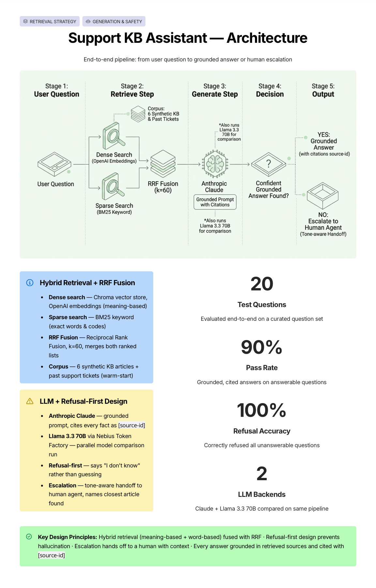

# Support KB Assistant

A small customer-support assistant that answers questions using a knowledge base,
not just the model's own memory. It finds the most relevant pieces of text, then
asks the model to answer using only those pieces and to cite where each fact came
from. If the answer is not in the knowledge base, it says so.

This is a Week 2 project for the Mastering Agentic AI course. It is also a public
slice of a larger customer-support agent (the course capstone). All data here is
made up. There are no real company names or real customer details.

## What it does

- Reads a small set of help articles and past support tickets.
- Breaks them into small pieces (chunks) and turns each piece into numbers (an
  embedding) so the system can find pieces that match a question.
- For each question, it searches two ways at once:
  - by meaning (dense / vector search), and
  - by exact words (sparse / BM25 keyword search).
- It joins the two result lists into one (Reciprocal Rank Fusion), keeps the top
  few pieces, and asks the model to write a grounded answer with citations.
- If the model cannot ground a confident answer, it escalates to a human agent
  with a tone-matched handoff message rather than refusing silently.

## Architecture flow



## How to run it

1. Create and activate a virtual environment, then install the packages:

   ```sh
   pip install -r requirements.txt
   ```

2. Copy `.env.example` to `.env` and fill in your keys.

3. Build the search index once:

   ```sh
   python3 src/ingest.py
   ```

4. Start the app:

   ```sh
   python3 -m streamlit run src/app.py
   ```

   Export your keys in the same terminal session before you start the app.

## Project layout

```text
support-kb-rag/
  corpus/
    kb/              help articles (Markdown)
    tickets/         past support tickets (the "warm-start" data)
    metadata.json    tags for each article (doc_type, product_area)
  src/
    embeddings.py    turns text into numbers (OpenAI by default; local option)
    ingest.py        build-time: load, chunk, embed, store
    rag.py           run-time: hybrid retrieve, fuse, grounded answer
    app.py           Streamlit chat UI with escalation-to-human handoff
  requirements.txt
  .env.example
  evaluation-report.md
```

## Status

Week 2 submission — complete. The build includes hybrid retrieval (BM25 + dense,
RRF-fused), a Streamlit chat interface, a Nebius model comparison (Claude vs
Llama 3.3 70B), and escalation-to-human handoff with tone-aware messaging.

Evaluated against 20 synthetic questions: **18/20 passed (90%), 100% refusal
accuracy.** See `evaluation-report.md` for the full analysis including failure
breakdowns and model comparison.
